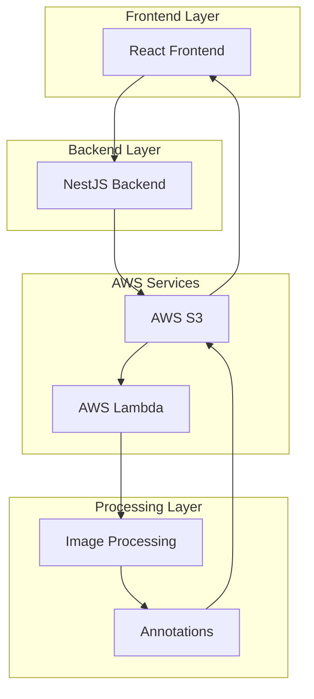

# 🚀 Smart Uploader + Lambda Annotator

[](https://circleci.com/gh/yourusername/smart-uploader-lambda-annotator)
[](https://opensource.org/licenses/MIT)
[](https://www.typescriptlang.org/)
[](https://reactjs.org/)
[](https://nestjs.com/)
[](https://aws.amazon.com/lambda/)

> **A modern, full-stack microservice application for intelligent image processing and annotation using AWS Lambda, React, and NestJS.**

Transform your images with AI-powered edge detection, grayscale conversion, and automated annotation generation. Built with cutting-edge technologies for scalability, performance, and developer experience.

## ✨ Features

### 🎯 **Core Functionality**

- **🖼️ Smart Image Upload** - Drag & drop interface with real-time validation
- **🔍 AI-Powered Processing** - Edge detection, grayscale conversion, and contour analysis
- **📊 Interactive Dashboard** - Real-time image preview with overlay annotations
- **⚡ Serverless Architecture** - AWS Lambda for scalable image processing
- **🔄 Real-time Updates** - Live status tracking and processing updates

### 🛠️ **Technical Excellence**

- **🎨 Modern UI/UX** - Material UI with responsive design
- **🔒 Type Safety** - Full TypeScript implementation
- **🧪 Comprehensive Testing** - Unit, integration, and E2E tests
- **🚀 CI/CD Pipeline** - Automated testing and deployment
- **🐳 Container Ready** - Docker support for easy deployment
- **☁️ Cloud Native** - AWS services integration

### 📈 **Enterprise Ready**

- **🔐 Security First** - Input validation, CORS, and secure file handling
- **📊 Monitoring** - CloudWatch integration and performance tracking
- **🔄 Scalability** - Serverless architecture for automatic scaling
- **📝 Documentation** - Comprehensive API documentation and guides

## 🏗️ Architecture



## 🚀 Quick Start

### Prerequisites

- **Node.js** 18+ ([Download](https://nodejs.org/))
- **Python** 3.9+ ([Download](https://www.python.org/))
- **Docker** & Docker Compose ([Download](https://www.docker.com/))
- **AWS CLI** configured ([Setup Guide](https://docs.aws.amazon.com/cli/latest/userguide/cli-chap-configure.html))
- **Serverless Framework** CLI ([Install](https://www.serverless.com/framework/docs/getting-started))

### 🛠️ Installation

1. **Clone the repository**

   ```bash
   git clone https://github.com/yourusername/smart-uploader-lambda-annotator.git
   cd smart-uploader-lambda-annotator
   ```

2. **Install all dependencies**

   ```bash
   npm run install:all
   ```

3. **Set up environment variables**

   ```bash
   # Copy environment files
   cp frontend/env.example frontend/.env
   cp backend/env.example backend/.env
   cp lambda/env.example lambda/.env

   # Edit the files with your configuration
   nano frontend/.env
   nano backend/.env
   nano lambda/.env
   ```

4. **Start the application**

   ```bash
   # Using Docker Compose (Recommended)
   docker-compose up -d

   # Or start services individually
   npm run start:dev
   ```

5. **Access the application**
   - 🌐 **Frontend**: http://localhost:3000
   - 🔧 **Backend API**: http://localhost:3001
   - 📚 **API Docs**: http://localhost:3001/api

## 🧪 Testing

Run comprehensive test suites across all components:

```bash
# Run all tests
npm test

# Frontend tests
npm run test:frontend

# Backend tests
npm run test:backend

# Lambda tests
npm run test:lambda

# E2E tests
npm run test:e2e
```

## 🚀 Deployment

### 🐳 Docker Deployment

```bash
# Production deployment
docker-compose -f docker-compose.prod.yml up -d

# Development deployment
docker-compose up -d
```

### ☁️ AWS Serverless Deployment

```bash
# Deploy to development
npm run deploy:dev

# Deploy to staging
npm run deploy:staging

# Deploy to production
npm run deploy:prod
```

### 🔧 Manual Deployment

```bash
# Build frontend
cd frontend && npm run build

# Build backend
cd backend && npm run build

# Deploy Lambda function
cd infrastructure && serverless deploy
```

## 📊 API Reference

### 🔐 Authentication

All endpoints require proper authentication headers.

### 📤 Upload Endpoints

| Method | Endpoint                      | Description       |
| ------ | ----------------------------- | ----------------- |
| `POST` | `/api/upload`                 | Upload image file |
| `GET`  | `/api/upload/:id`             | Get upload status |
| `GET`  | `/api/upload/:id/annotations` | Get annotations   |

### 🖼️ Image Management

| Method   | Endpoint          | Description       |
| -------- | ----------------- | ----------------- |
| `GET`    | `/api/images`     | List all images   |
| `GET`    | `/api/images/:id` | Get image details |
| `DELETE` | `/api/images/:id` | Delete image      |

### ⚙️ Processing Endpoints

| Method | Endpoint                  | Description              |
| ------ | ------------------------- | ------------------------ |
| `POST` | `/api/process/:id`        | Trigger image processing |
| `GET`  | `/api/process/:id/status` | Get processing status    |

### 📝 Request/Response Examples

**Upload Image**

```bash
curl -X POST http://localhost:3001/api/upload \
  -H "Content-Type: multipart/form-data" \
  -F "image=@/path/to/image.jpg"
```

**Response**

```json
{
  "id": "uuid-12345",
  "status": "success",
  "message": "Image uploaded successfully and processing started",
  "filename": "image.jpg",
  "originalUrl": "https://bucket.s3.amazonaws.com/uploads/uuid-12345-image.jpg"
}
```

## 🛠️ Tech Stack

### Frontend

- **React 18** - Modern UI framework
- **Material UI (MUI)** - Beautiful, accessible components
- **TypeScript** - Type safety and better DX
- **Axios** - HTTP client for API communication
- **React Router** - Client-side routing
- **React Dropzone** - File upload handling

### Backend

- **NestJS** - Progressive Node.js framework
- **TypeScript** - Type-safe backend development
- **AWS SDK** - AWS services integration
- **Jest** - Testing framework
- **Multer** - File upload middleware

### Lambda Function

- **Python 3.9** - High-performance scripting
- **OpenCV** - Computer vision and image processing
- **NumPy** - Numerical computing
- **Boto3** - AWS SDK for Python
- **Pillow** - Image manipulation

### Infrastructure

- **AWS S3** - Object storage
- **AWS Lambda** - Serverless computing
- **AWS API Gateway** - REST API management
- **Docker Compose** - Container orchestration
- **Serverless Framework** - Infrastructure as Code

### DevOps

- **CircleCI** - Continuous integration
- **LocalStack** - AWS emulation
- **Nginx** - Web server (production)
- **Jest** - JavaScript testing
- **Pytest** - Python testing

## 📁 Project Structure

```
smart-uploader-lambda-annotator/
├── 📁 frontend/                 # React + Material UI application
│   ├── 📁 src/
│   │   ├── 📁 components/       # Reusable UI components
│   │   ├── 📁 pages/           # Page components
│   │   ├── 📁 services/        # API services
│   │   └── 📁 __tests__/       # Unit tests
│   ├── 📁 public/              # Static assets
│   └── package.json            # Frontend dependencies
├── 📁 backend/                  # NestJS API server
│   ├── 📁 src/
│   │   ├── 📁 upload/          # Upload module
│   │   ├── 📁 images/          # Images module
│   │   ├── 📁 processing/      # Processing module
│   │   └── 📁 shared/          # Shared services
│   └── package.json            # Backend dependencies
├── 📁 lambda/                   # AWS Lambda function (Python)
│   ├── handler.py              # Main Lambda function
│   ├── test_handler.py         # Unit tests
│   └── requirements.txt        # Python dependencies
├── 📁 infrastructure/          # Infrastructure as Code
│   └── 📁 localstack/          # LocalStack setup
├── 📁 .circleci/               # CI/CD pipeline
├── docker-compose.yml          # Local development
├── docker-compose.prod.yml     # Production deployment
├── serverless.yml             # Serverless Framework config
└── README.md                  # This file
```

## 🔧 Configuration

### Environment Variables

#### Frontend Configuration

```env
REACT_APP_API_URL=http://localhost:3001
REACT_APP_S3_BUCKET=your-s3-bucket
REACT_APP_AWS_REGION=us-east-1
```

#### Backend Configuration

```env
PORT=3001
AWS_REGION=us-east-1
AWS_S3_BUCKET=your-s3-bucket
AWS_LAMBDA_FUNCTION=image-processor
AWS_ACCESS_KEY_ID=your-access-key
AWS_SECRET_ACCESS_KEY=your-secret-key
NODE_ENV=development
```

#### Lambda Configuration

```env
AWS_REGION=us-east-1
S3_BUCKET=your-s3-bucket
AWS_ACCESS_KEY_ID=your-access-key
AWS_SECRET_ACCESS_KEY=your-secret-key
```

## 🤝 Contributing

We welcome contributions! Please follow these steps:

1. **Fork the repository**
2. **Create a feature branch**
   ```bash
   git checkout -b feature/amazing-feature
   ```
3. **Make your changes**
4. **Add tests** for new functionality
5. **Run the test suite**
   ```bash
   npm test
   ```
6. **Commit your changes**
   ```bash
   git commit -m 'Add amazing feature'
   ```
7. **Push to the branch**
   ```bash
   git push origin feature/amazing-feature
   ```
8. **Open a Pull Request**

### 🧪 Development Guidelines

- Write tests for all new features
- Follow TypeScript best practices
- Use conventional commit messages
- Update documentation as needed
- Ensure all tests pass before submitting PR

## 📝 License

This project is licensed under the MIT License - see the [LICENSE](LICENSE) file for details.

## 🆘 Support & Community

### 📚 Documentation

- [API Documentation](docs/api.md)
- [Deployment Guide](docs/deployment.md)
- [Contributing Guidelines](CONTRIBUTING.md)

### 🐛 Issues & Questions

- **Bug Reports**: [Create an issue](https://github.com/yourusername/smart-uploader-lambda-annotator/issues/new?template=bug_report.md)
- **Feature Requests**: [Create an issue](https://github.com/yourusername/smart-uploader-lambda-annotator/issues/new?template=feature_request.md)
- **Questions**: [Create a discussion](https://github.com/yourusername/smart-uploader-lambda-annotator/discussions)

### 🔗 Links

- **Live Demo**: [Coming Soon]
- **Documentation**: [Coming Soon]
- **Changelog**: [CHANGELOG.md](CHANGELOG.md)

## 🙏 Acknowledgments

- **OpenCV** for powerful image processing capabilities
- **Material UI** for beautiful, accessible components
- **NestJS** for the excellent backend framework
- **AWS** for robust cloud infrastructure
- **React** for the amazing frontend framework

## 📊 Project Status

- ✅ **Core Features**: Complete
- ✅ **Testing**: Comprehensive test coverage
- ✅ **Documentation**: Complete
- ✅ **CI/CD**: Automated pipeline
- 🔄 **Performance**: Ongoing optimization
- 🔄 **Security**: Regular audits

---

<div align="center">

**Made with ❤️ by [Your Name]**

[](https://github.com/yourusername)
[](https://linkedin.com/in/yourusername)
[](https://twitter.com/yourusername)

**⭐ Star this repository if you found it helpful!**

</div>
